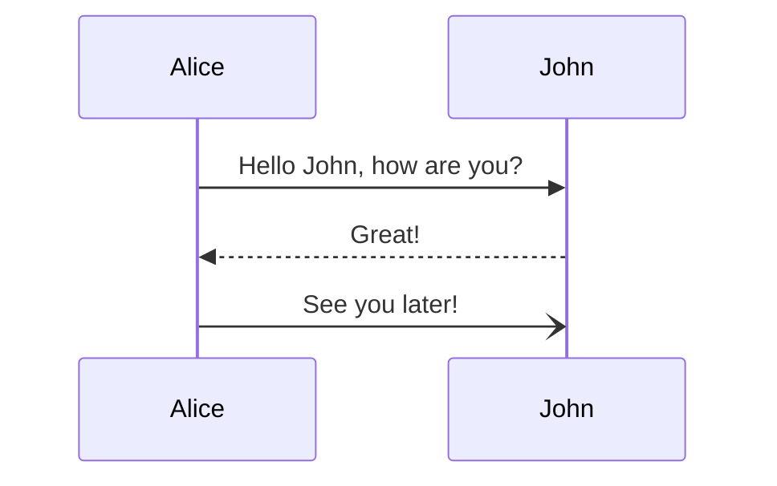
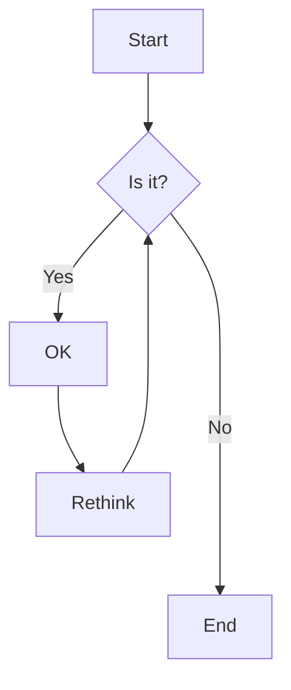
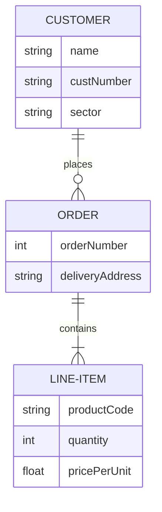

Document系は、GitHub上(**github.devエディター**)で編集する。

◯ 修正履歴 -> GitHubでversion管理できる。 
◯ 画像ファイル -> MarkdownファイルにCopy&PasteでGitHubサーバ上にアップロードできる。 
◯ UML図 -> Markdownファイルに**Mermaid構文で書けばOK** 
 
🔴**READMEファイルで説明しづらい内容,サイズ感のものは、ExcelやER図専用エディタで作成した方がわかりやすいだろう。**

## mermaid構文
### Sequence diagram

### Flowchart

### ER図
Entity Relationship diagram

